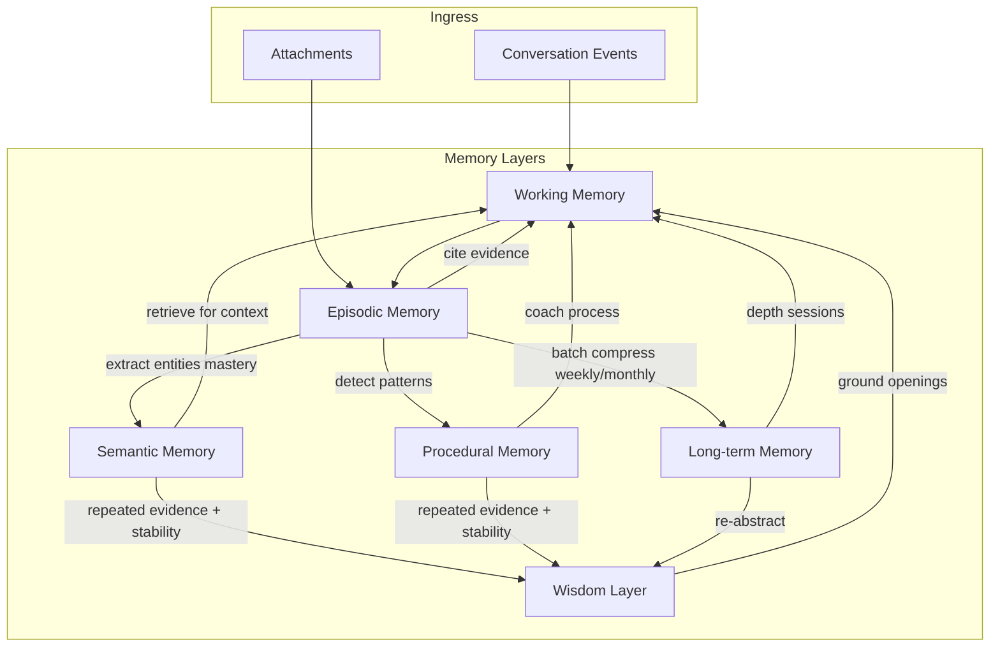

# ADR-004: Memory Architecture

**Status:** Accepted  
**Date:** 2026-06-29  
**Deciders:** Ashish (Product Owner), Principal Architect

---

## Context

Agent Watson's differentiation is **mentorship with memory** — not retrieval from a document pile. The SRS defines episodic, semantic, and procedural memory (FR-MEM-01–09) and mentor behaviors that cite provenance (FR-MEM-04). ADR-001 makes conversation the ingress; ADR-003 partitions sensitivity.

Vector-only "memory" (embed everything, retrieve top-k) fails mentors because it conflates **what happened**, **what is true**, **how you do things**, and **what matters now**. Human memory is layered; Watson's architecture should reflect that without over-engineering cognitive science.

## Problem Statement

A single flat embedding index cannot:

- Distinguish "Ashish mentioned gradients Tuesday" (episode) from "Ashish understands backprop" (semantic belief).
- Track staleness — CAT quant topic untouched for 14 days.
- Represent mentor **working context** for the current turn without dumping 5 years of chat.
- Compress years of dialogue into mentor-relevant **wisdom** without losing audit trail.
- Support correction — "that's wrong" must update beliefs without deleting history.

We need a **memory architecture** with explicit layers, lifecycle rules, and promotion/demotion paths between layers.

## Decision

**Implement a six-layer memory model with explicit lifecycle transitions. Each layer has a distinct role in mentorship; retrieval composes from multiple layers; raw conversation events remain immutable at the bottom.**

### Layer definitions

| Layer | Role | Contents | Typical TTL in mentor context |
|-------|------|----------|-------------------------------|
| **Working Memory** | Current turn/session coherence | Active conversation turns, attached files in session, pending growth moves, user's last correction | Current session + last N turns |
| **Episodic Memory** | What happened, when, with whom/what | Timestamped events: conversation turns, attachments ingested, accept/defer decisions, mock test mentioned | Retrieved by recency + relevance |
| **Semantic Memory** | What Ashish knows, believes, is learning | Concepts, skills, facts, goal states, mastery estimates, relationships between concepts | Retrieved by relevance + goal linkage |
| **Procedural Memory** | How Ashish works and studies | Observed patterns: "reviews CAT quant mornings," "debugs by rewriting," "skips VARC when stressed" | Retrieved when coaching process |
| **Long-term Memory** | Compressed narrative of eras | Period summaries: "Q1 2027: CAT focus intensified; work project Alpha dominated March" | Retrieved for depth sessions / long arc |
| **Wisdom Layer** | Stable, mentor-grade insight | Distilled principles Ashish has earned: values, recurring strengths, failure patterns, career thesis — always provenance-linked | Sparse; high weight when retrieved |

**Wisdom is not mysticism** — it is **high-confidence semantic + procedural synthesis** with long evidence chains, subject to correction. Example: "You tend to overcommit when excited about a new AI paper (evidence: 4 episodes across 8 months)."

### Information lifecycle

### Transition rules (conceptual)

1. **Conversation → Episodic:** Every message/attachment immediately persisted as immutable episode with tier tag (ADR-003).
2. **Episodic → Semantic:** Background extraction after turn (or batch) proposes entities, mastery updates, goal links. User correction overrides.
3. **Episodic → Procedural:** Pattern detector notices repeated sequences (study order, emotional triggers, deferral patterns) across ≥3 episodes.
4. **Episodic → Long-term:** Scheduled compression (weekly/monthly) produces era summaries; episodes remain for drill-down.
5. **Semantic + Procedural → Wisdom:** Promotion when (a) high confidence, (b) multiple independent episodes, (c) stable over ≥30 days, (d) user has not corrected. Demotion on correction or contradicting episodes.
6. **Working Memory:** Assembled per turn from retrieval across layers; never persisted as authoritative — rebuilt each time.

### Retrieval strategy for mentorship

Not one vector search. **Composed retrieval:**

- Always: working memory + active goals + stale concepts list.
- On opening: episodic (yesterday, last session) + wisdom (if relevant) + staleness nudges.
- On user question: semantic + episodic evidence for claim.
- On "how should I study?": procedural + semantic prerequisites.
- On weekly depth: long-term + wisdom + cross-domain links.

## Alternatives Considered

### A. Vector-only memory

Embed all messages; retrieve top-k per turn.

**Rejected.** No mastery, staleness, or procedural coaching. Confuses mention with mastery. Poor correction model. Cheap to build, fails mentor test.

### B. Relational-only (no vectors)

SQL tables for facts; keyword search.

**Rejected.** Ashish's questions are semantic ("what was that paper about optimization?"). Keyword fails on paraphrase. Hybrid needed (ADR-005).

### C. Full knowledge graph as sole memory

Every concept is a node; episodes hang off edges.

**Rejected as sole store.** Graph excels at relationships but awkward for narrative episode retrieval and compression tiers. Use as part of hybrid (ADR-005).

### D. Mirror human neuroscience exactly

Hippocampus simulation, etc.

**Rejected.** Over-engineering; no shipping benefit. Six layers are **engineering abstractions**, not biology claims.

### E. External memory service (Mem0, Zep, etc.)

**Deferred evaluation.** May accelerate v1 if contract matches layers and local-first. Risk: vendor shape mismatch, cloud dependency. If adopted, map vendor concepts to our layers in ADR-014; vault remains local source of truth.

## Pros

- **Mentor-quality retrieval** — right abstraction for each mentorship move (cite episode vs coach process vs name pattern).
- **Staleness and mastery** — semantic layer enables "you haven't touched X" without LLM guessing.
- **Scales in time** — long-term + wisdom prevent context blow-up (ADR-010).
- **Correction path** — episodic immutable; semantic/wisdom updateable; provenance preserved.
- **Aligns with SRS** — FR-MEM-01–09 map cleanly to layers.

## Cons

- **Extraction pipeline required** — episodic→semantic not free; LLM extraction costs and errors.
- **Layer sync bugs** — semantic out of sync with episodes if extraction fails.
- **Wisdom promotion errors** — false patterns become sticky; needs correction + demotion rules.
- **More moving parts** than vector-only MVP — must phase delivery (see below).

## Trade-offs

| We gain | We sacrifice |
|---------|--------------|
| Mentor depth | MVP simplicity |
| Auditable belief states | Fully automatic trust |
| Decades of data | Single-index hack |

**MVP phasing (recommended):**

- **MVP:** Working + Episodic + Semantic (basic mastery/staleness). Procedural (light). Long-term (manual weekly batch). Wisdom (deferred — use high-weight semantic instead).
- **P1:** Procedural patterns, automated long-term compression, wisdom promotion.

## Future Implications

- Growth Engine (ADR-012) reads primarily semantic + episodic signals, not gamification counters.
- Embedding strategy (ADR-009) tags chunks with layer hints at index time.
- Prompt assembly (ADR-010) allocates token budget per layer.
- Vault UI shows layer provenance: "this belief came from these episodes."

**SRS note:** Wisdom layer extends SRS semantic/procedural memory without contradicting it — document as implementation refinement.

## When This Decision Should Be Revisited

Revisit if:

1. **Extraction quality** cannot maintain semantic layer — consider more episodic-heavy mentorship with lighter beliefs.
2. **Managed memory product** fits local-first with clean layer mapping — evaluate replace vs integrate.
3. **Layer count** causes ops burden without quality gain — collapse long-term into episodic summaries only (4 layers).
4. **Wisdom layer** produces harmful generalizations — tighten promotion thresholds or remove until eval harness exists.

Do not collapse to vector-only because "retrieval seems to work" in first 30 days — long-horizon failure appears at 6+ months.
