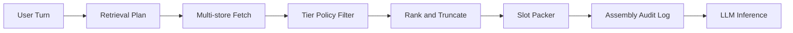

# ADR-010: Prompt Architecture

**Status:** Accepted  
**Date:** 2026-06-29  
**Deciders:** Ashish (Product Owner), Principal Architect

---

## Context

Mentor inference (ADR-006) requires assembling context from memory layers (ADR-004), hybrid stores (ADR-005), tier policy (ADR-003), and behavioural contract (ADR-011) into a bounded LLM prompt. Conversation-first (ADR-001) means every turn runs this pipeline — potentially multiple times daily for years.

Bad prompt architecture causes: context overload (lost middle), tier leaks, generic mentorship, runaway costs, and inability to debug "why did Watson say that?"

## Problem Statement

We must design the **prompt assembly pipeline** — not a static system prompt, but a deterministic orchestration that decides:

- What context enters the LLM?
- In what order?
- How much of each layer?
- How do we prevent context overload?
- How do we separate mentor, extractor, and compressor roles?

## Decision

**Implement a tier-aware, budget-limited, ordered context assembly pipeline with fixed slots, explicit truncation policies, and full audit logs — separate assembly profiles per inference role.**

### Pipeline stages

1. **Retrieval plan** — deterministic rules based on turn type (opening, mid-session, depth, search-as-chat, correction).
2. **Multi-store fetch** — relational + vector + graph per ADR-005.
3. **Tier filter** — strip or route T0 from cloud payload (ADR-003).
4. **Rank and truncate** — per-slot budgets; rerank if budget exceeded.
5. **Slot packer** — ordered message construction.
6. **Audit log** — store slot IDs and token counts, not necessarily full text for cloud logs.

### Context slots (mentor role) — order matters

LLMs attend more strongly to beginning and end. Order:

| Order | Slot | Content | Typical budget |
|-------|------|---------|----------------|
| 1 | **Behavioural contract** | ADR-011 mentor personality — stable, versioned | Fixed ~800 tokens |
| 2 | **Session state** | Mode (daily / depth / quick), turn type, time since last session | ~200 |
| 3 | **Goals snapshot** | Active goals, deadlines, drift flags | ~400 |
| 4 | **Staleness nudges** | Top stale concepts/skills (relational) | ~300 |
| 5 | **Retrieved evidence** | Episodic chunks + semantic summaries with IDs | ~2000–3500 |
| 6 | **Procedural hints** | Study patterns if coaching process | ~300 |
| 7 | **Long-term / wisdom** | Only in depth mode | ~500–800 |
| 8 | **Working memory** | Recent conversation turns (last N) | ~1500–2500 |
| 9 | **Growth moves pending** | Unresolved accept/defer from last session | ~200 |
| 10 | **User message** | Current input + inline attachments summary | Variable |

**User message last among content** (contract first is system; user last in user role) — classic pattern for instruction following.

Total mentor budget target: **~6k–8k tokens input** for MVP models; adjust per model context window. Reserve output tokens for response + growth moves.

### Turn-type retrieval plans

| Turn type | Retrieval emphasis |
|-----------|-------------------|
| **Session opening** | Yesterday episodes, last session summary, goals, staleness top-5, optional wisdom |
| **Mid-session capture** | Light — working memory + goals; defer heavy retrieval unless user asks |
| **Explicit question** | Vector search on query + graph neighbors + episodic evidence |
| **Correction** | Targeted fetch disputed memory + source episodes |
| **Depth / weekly** | Long-term summaries + wisdom + cross-domain graph paths |
| **Search-as-chat** | Heavy vector + FTS; mentor answers with citations |

### Context overload prevention

1. **Hard token budget per slot** — never exceed; truncate lowest-ranked items first within slot.
2. **Recency + relevance merge rank** — score = `α·similarity + β·recency + γ·goal_link + δ·mastery_staleness`.
3. **Summarize overflow** — if episode cluster > budget, compressor role produces 200-token evidence summary **with episode ID list** — never drop IDs.
4. **No full vault dump** — retrieval plan caps max chunks (e.g., 12 episode + 8 semantic).
5. **Progressive depth** — mid-session stays light; user asks "go deeper" triggers expanded plan.
6. **Deduplication** — same `episode_id` from vector + graph collapse to one entry.
7. **Working memory sliding window** — summarize turns older than N into one session summary event (episodic layer).

### Extractor assembly profile

Separate smaller prompt:

- Behavioural: "extract structured memory updates only"
- Input: user message + mentor response + cited evidence IDs
- Output: JSON schema — entities, mastery deltas, goal links, tier suggestions
- Budget: ~3k tokens; no wisdom/long-term

### Compressor assembly profile

- Input: episode batch for period
- Output: long-term summary + optional wisdom candidates
- Long context model; runs weekly — not per turn

### Versioning

- `prompt_contract_version` in behavioural slot — bump when ADR-011 changes.
- Assembly profiles versioned in config — reproducible mentor behavior.

## Alternatives Considered

### A. Single static system prompt + user message only

**Rejected.** No memory; violates entire product thesis.

### B. Agentic retrieval loop (model decides each fetch)

**Rejected as default.** Harder to audit tier leaks; slower; costlier. Optional for research mode P1.

### C. Largest context window — retrieve everything

**Rejected.** Cost, latency, lost-middle, tier risk at scale.

### D. RAG top-20 chunks unordered blob

**Rejected.** No slot discipline; goals and staleness drowned out.

### E. Multiple parallel LLM calls per turn

Mentor + extractor always parallel.

**Partial.** Extractor post-turn async is fine; parallel mentor+extractor same turn risks inconsistency. **Decision:** mentor responds first; extractor runs after mentor turn committed.

## Pros

- **Debuggable** — audit log shows slots and IDs.
- **Tier-safe** — filter before pack, verify before HTTP.
- **Predictable cost** — token caps per turn type.
- **Mentor quality** — goals and staleness always present in openings.
- **Role separation** — extractor/compressor don't bloat mentor prompt.

## Cons

- **Complex orchestrator** — many rules to maintain.
- **Ranking tuning** — requires eval harness over time.
- **Truncation regret** — wrong chunk dropped → weak citation; mitigated by rerankers.
- **Contract token overhead** — ~800 tokens every call.

## Trade-offs

| We gain | We sacrifice |
|---------|--------------|
| Control | Naive simplicity |
| Auditability | Maximal context |
| Cost predictability | "Throw it all in" |

## Future Implications

- Learned reranker from Ashish's accept/dismiss signals (growth engine feedback).
- Cache goal snapshot within session if unchanged.
- Model-specific budget profiles in config.
- User-visible "sources used" panel maps 1:1 to evidence slot IDs.

**SRS alignment:** Implements context assembly from SRS §2.2 and FR-MENTOR-02, FR-MENTOR-04 without modification.

## When This Decision Should Be Revisited

Revisit if:

1. **Model context windows** 128k+ cheap — raise evidence budget but keep slot order and tier filter.
2. **Retrieval eval** shows ranking formula systematically wrong — invest in reranker before restructuring slots.
3. **Agentic retrieval** with tier sandbox proven safe — optional mode for depth research.
4. **Latency** — assembly >5s before LLM — optimize fetch parallelism, index warming.

Never remove tier filter or audit log to simplify.
