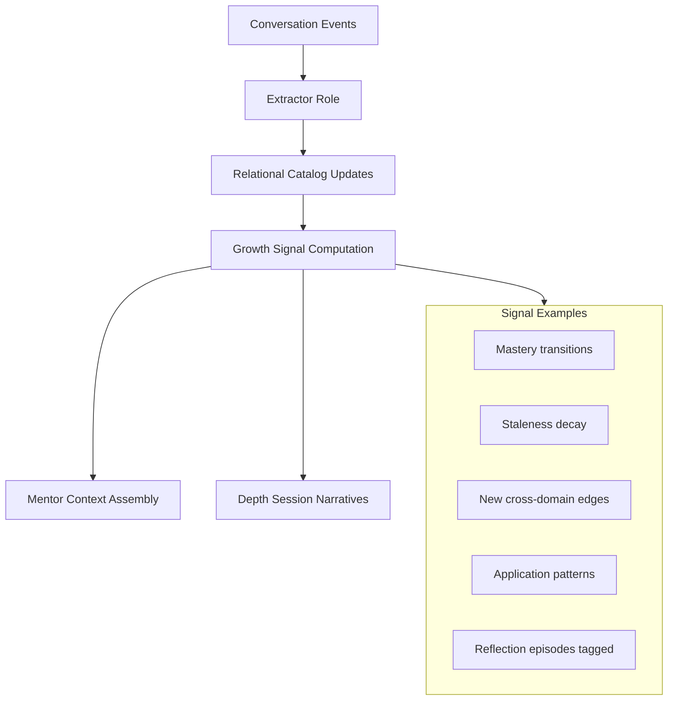

# ADR-012: Growth Engine

**Status:** Accepted  
**Date:** 2026-06-29  
**Deciders:** Ashish (Product Owner), Principal Architect

---

## Context

Agent Watson must help Ashish **grow** — not track productivity. SRS §11 defines Daily Growth Conversation (DGC) as North Star, explicitly rejecting streaks and gamification. ADR-004 provides memory layers; ADR-005 relational catalog holds mastery and episodes; ADR-011 forbids points and streak shame.

We need a **Growth Engine** — how growth is **inferred** from conversation and memory, how Watson **uses** those signals in mentorship, and how Ashish **recognizes** growth without dashboards.

## Problem Statement

Manual tracking (checkboxes, habit apps) fails because:

- Ashish won't maintain parallel tracking systems (conversation-first, ADR-001).
- Self-report bias — "I studied" vs demonstrated understanding.
- Gamification optimizes engagement metrics, not competence (SRS rejection).

Pure LLM judgment ("you're improving!") fails because:

- Unauditable; violates B-04 (ADR-011).
- Inconsistent across sessions.

We need **inferential growth signals** — computed from evidence — that feed mentor openings, depth sessions, and optional narrative reflection **in dialogue**.

## Decision

**Implement a Growth Engine as a signal layer over memory — inferring growth dimensions from episodic and semantic evidence — surfaced primarily through Watson's conversation, never through streak counters or points.**

### Growth dimensions (not metrics for leaderboard)

| Dimension | What it means | Inference sources |
|-----------|---------------|-------------------|
| **Learning** | New concepts/skills encountered | First mention episodes; new semantic nodes; attachment ingest topics |
| **Reflection** | Insight articulated, not just activity logged | User responses to mentor prompts; correction depth; "I realized…" extraction |
| **Application** | Knowledge used in new context | Cross-episode same concept in work vs study; graph `applied_in` edges |
| **Consistency** | Return to domains without shame framing | Conversation frequency; domain recurrence — **not streak count displayed** |
| **Mastery** | Depth and stability of understanding | Mastery state transitions (introduced→practicing→solid); error recurrence drop |
| **Career growth** | Skills and narrative toward role targets | Skill graph progress; goal-linked episodes; transferable skill extraction |
| **CAT growth** | Exam-specific readiness | Section mentions, error types, mock results in dialogue, weak-area recurrence |
| **Knowledge connections** | Links between domains | New graph edges; mentor-surfaced connections Ashish confirms |

These are **dimensions for inference**, not KPI widgets.

### Inference pipeline (conceptual)

**Batch cadence:**

- **Per turn:** light updates — mastery touch, goal link, growth move outcome.
- **Daily batch:** staleness recompute, consistency window (7-day presence, not streak integer).
- **Weekly:** dimension summaries for depth conversation — prose-ready, evidence-linked.

### How signals feed mentorship (not dashboards)

| Signal | Mentor use |
|--------|------------|
| Mastery ↑ | "Backprop clicked — you went from practicing to solid." |
| Mastery stale | Opening nudge, not alarm |
| New connection | "Your debugging approach mirrors DILR elimination…" |
| Application | "You used Bayes at work — that's the third context." |
| Reflection-rich week | Depth praise without points — "You articulated more insights this week." |
| CAT weak area recurring | Specific practice move, not "VARC score 62%" chart |
| Career skill evidence | "Three episodes support system design growth." |
| Consistency dip | Gentle: "Work dominated this week — one small CAT move?" |

**All surfaced in dialogue** per ADR-001. Optional vault view shows raw signals for audit — not default UX.

### Growth moves feedback loop

When Ashish **accepts / defers / declines** a growth move:

- Accepted → expect application signal in future episodes; if absent, mentor asks follow-through (WMBC opening pattern).
- Deferred → resurface with lower priority, not guilt.
- Declined → reduce similar moves; log preference.

This is **personalization**, not scoring.

### What we explicitly do NOT build

- Streak counters, badges, levels, XP.
- Leaderboards (nonsensical for single user anyway).
- Red/green dashboard tiles.
- Daily "growth score" number Ashish optimizes.
- Push notifications shame ("you missed yesterday!").

**Reminders:** neutral "Watson is ready" (SRS FR-SEC-04), not streak-breaking warnings.

### North Star linkage

**Daily Growth Conversation (DGC)** = qualitative session outcome:

Post-turn classifier (light) tags session:

- `insight` | `clarity` | `growth_move_engaged` | `connection` | `none`

Stored for weekly review — not shown as points. Target: ≥5 days/week with non-`none` tag (SRS §11.2).

### Confidence on growth claims

Watson may only **state growth in dialogue** when:

- Signal confidence ≥ threshold (e.g., ≥2 independent episodes for application).
- Otherwise WMBC B-03 — "it seems…" or ask Ashish.

## Alternatives Considered

### A. Manual goal progress sliders

**Rejected.** Form-based; violates conversation-first.

### B. Gamification (streaks, XP)

**Rejected.** SRS and ADR-011 explicit rejection.

### C. LLM-only growth assessment each session

"Rate Ashish's growth 1–10."

**Rejected.** Unauditable; sycophancy; no provenance.

### D. External app integrations for metrics (RescueTime, etc.)

**Deferred P2.** Passive signal optional; not MVP.

### E. Full competency framework rubric (DTCC corporate)

**Rejected for MVP.** Too heavy; infer from life episodes instead.

## Pros

- **Aligned with mentorship** — growth is discussed, not displayed.
- **Evidence-backed** — signals trace to episodes.
- **No parallel tracking** — conversation is input.
- **Anti-shame** — consistency without streak UI.
- **Feeds retrieval** — staleness and mastery improve openings (ADR-010).

## Cons

- **Inference lag** — growth felt after patterns emerge, not day 1.
- **False mastery** — extractor over-promotes; needs correction loop.
- **Hard to demo** — no flashy chart for outsiders.
- **Classifier error** — DGC tags wrong without eval.

## Trade-offs

| We gain | We sacrifice |
|---------|--------------|
| Intrinsic motivation | Extrinsic gamification hooks |
| Honest mirror | Instant gratification metrics |
| Single input stream | Rich external telemetry |

## Future Implications

- CAT mock structured ingest improves CAT growth dimension precision.
- Calendar integration adds time allocation signal — not hours-tracked UI.
- Ashish can ask "how am I growing?" — Watson narrates dimensions with evidence (search-as-chat).
- Export yearly "growth narrative" for career — prose document from long-term layer, not spreadsheet.

**SRS recommendation:** Replace any future "streak visibility" risk mention in risks section with Growth Engine approach — SRS risk mitigation already says "value on day 1" not streaks; aligned.

## When This Decision Should Be Revisited

Revisit if:

1. **Ashish wants minimal numbers** — e.g., CAT mock score trend only in vault, never conversation — add optional private metrics view.
2. **Inference unreliable** — more explicit confirmation in dialogue ("does that feel solid now?").
3. **Gamification request** — reject by default; revisit only if intrinsic approach fails engagement for 90 days.
4. **External telemetry** adds high-signal data — integrate as episodic events, not dashboard.

Never add streaks because engagement metrics dip — fix mentorship quality first.
