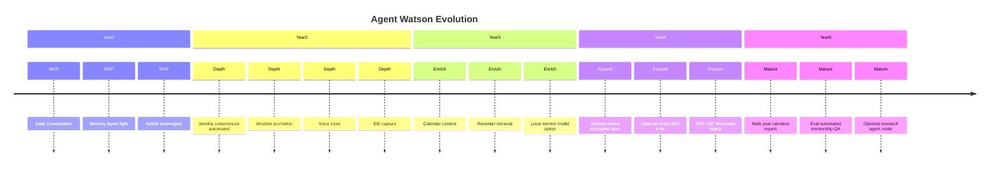

# ADR-013: Future Evolution

**Status:** Accepted  
**Date:** 2026-06-29  
**Deciders:** Ashish (Product Owner), Principal Architect

---

## Context

Agent Watson is a **long-horizon personal mentor** — SRS targets 12–36 month outcomes and decades of memory (ADR-004, ADR-008 NFR-DATA-01). ADR-002 commits to single-user v1 but product may evolve personally for 5+ years. ADRs 001–012 establish conversation-first, hybrid sovereignty, layered memory, hybrid knowledge stores, RAG, modular monolith, local SQLite vault, embedding versioning, prompt assembly, mentor contract, and growth inference.

This ADR defines **how the system evolves without major rewrites** — extension points, migration discipline, and phased capability — not a feature roadmap duplicate of SRS §9.

## Problem Statement

Personal software often dies from:

1. **Rewrite at year 2** — "data model was wrong" because episodes weren't immutable.
2. **Vendor entanglement** — memory trapped in Pinecone + OpenAI format.
3. **Scope explosion** — SaaS multi-tenant retrofit breaks everything (we avoid by ADR-002).
4. **Context collapse** — 5 years of chat unusable without compression strategy.
5. **Dead modules** — microservices half-deployed.

We need **evolution principles** and **concrete extension points** so 2029 Ashish still uses the same vault root, upgraded incrementally.

## Decision

**Evolve Agent Watson through immutable event core, versioned derived layers, portable vault unit, provider abstractions, and phased module activation — no big-bang rewrites.**

### 1. Immutable core (never rewrite)

| Artifact | Rule |
|----------|------|
| **Conversation events** | Append-only; schema version field; migrations add columns, never rewrite history |
| **Vault directory** | `vault/` root stable; new subsystems add subdirs, don't relocate old |
| **Stable IDs** | `episode_id`, `chunk_id`, `concept_id` never reassigned; merge uses supersede links |
| **Tier tags** | T0/T1/T2 semantics stable; new tiers require ADR |

**Derived layers** (semantic, vectors, summaries, growth signals) are **rebuildable from events** — acceptable to wipe and regenerate after bug.

### 2. Versioned contracts

| Contract | Version field | Bump triggers |
|----------|---------------|---------------|
| WMBC mentor personality | `wmbc-x.y` | ADR-011 change |
| Prompt assembly profiles | `assembly-x.y` | Slot order/budget change |
| Embedding model registry | `embedding_model_id` | ADR-009 |
| Extraction JSON schema | `extract_schema-x.y` | New memory fields |
| Event schema | `event_schema` per row | New event types |

Old versions supported during migration windows — compressor reprocesses if needed.

### 3. Five-year capability phases (architectural, not marketing)

Each phase **activates modules** already stubbed in monolith — not new repositories.

### 4. Extension points (build now, use later)

| Extension point | Purpose |
|-----------------|---------|
| `InferenceProvider` interface | Swap LLM vendors (ADR-006) |
| `EmbeddingProvider` interface | Local/cloud embed (ADR-009) |
| `IngestionParser` plugins | PDF, code, CAT mock, calendar |
| `RetrievalPlan` registry | New turn types without mentor rewrite |
| `GrowthSignal` registry | New dimensions without engine rewrite |
| `ConversationEvent` type enum | New ingress channels |
| `SensitivityPolicy` rules | Employer policy changes |

**Feature flags (personal):** Ashish config YAML — `voice_enabled: false` — not LaunchDarkly.

### 5. Data scale evolution without rewrite

| Year | Challenge | Architectural response |
|------|-----------|------------------------|
| 1 | <10k chunks | Direct vector search |
| 2 | 100k chunks | Reranker + staleness relational pre-filter |
| 3 | 1M chunks | Hierarchical retrieval — long-term summaries first, drill to episodes |
| 4–5 | 5M+ chunks | Partition indexes by year; archive cold years to compressed long-term only |

**Never** delete episodes — compress access path, not truth.

### 6. Module activation pattern

New capability checklist:

1. Events + catalog schema (if needed).
2. Extraction or ingest plugin.
3. Retrieval plan extension.
4. WMBC check — does it serve growth today in dialogue?
5. Growth signal (if applicable).
6. Eval cases.

**Forbidden:** new primary dashboard screen (ADR-001).

### 7. Multi-user / SaaS fork strategy (if ever)

Not planned. If triggered:

- **Fork product** or **separate vault per user installer** — not retrofit tenant_id (ADR-002).
- Reusable as library: inference abstraction, extraction schemas, WMBC, assembly orchestrator.
- Not reusable: SQLite single-file assumptions, no-auth localhost.

Document now to prevent accidental SaaS coupling.

### 8. Technology refresh

| Component | Refresh path |
|-----------|--------------|
| SQLite | Move to Postgres local if needed — migrate catalog; vault files unchanged |
| Vector index | Rebuild from catalog — embedding registry drives re-embed |
| FastAPI | Framework upgrade independent of vault |
| Frontend | Replace UI; API contract stable |
| LLM models | Config change + eval regression suite |

### 9. Testing as evolution guardrail

- **Tier leak tests** — permanent CI.
- **Citation accuracy** — sample suite grows yearly.
- **Vault round-trip** — export, restore, mentor turn succeeds.
- **Schema migration tests** — every migration ADR.

## Alternatives Considered

### A. Plan big microservices for year 3 now

**Rejected.** ADR-007; ops kill personal project.

### B. "We'll rewrite when we hit limits"

**Rejected.** Event immutability is cheaper now than archaeology later.

### C. Cloud vault migration path as default

**Rejected.** ADR-003 local-first.

### D. Feature flags for every experiment without eval

**Rejected.** Personal software — Ashish toggles config; eval decides defaults.

## Pros

- **Same relationship, better engine** — Ashish's story persists.
- **Incremental shipping** — modules activate phased.
- **Rebuild safety** — derived data regenerable.
- **Honest scope** — SaaS fork explicit, not hidden debt.

## Cons

- **Upfront discipline** — versioning feels heavy early.
- **Storage growth** — immutable events + indexes; disk is cheap.
- **Migration scripts** — solo maintainer burden — automate aggressively.

## Trade-offs

| We gain | We sacrifice |
|---------|--------------|
| 5-year continuity | Early velocity on hacks |
| Portable vault | Throwaway prototype mindset |

## Future Implications

- Annual **architecture review** — Ashish + checklist against this ADR.
- `vault/MANIFEST.json` — versions of contracts, last migration, embedding models active.
- Deprecation: mark ADRs deprecated; never silent behavior change.

### SRS Phase mapping (alignment, not SRS edit)

| SRS Phase | ADR-013 phase |
|-----------|---------------|
| MVP | Year 1 |
| Phase 2 domain depth | Year 2 |
| Phase 3 richer input | Year 3 |
| Phase 4 long horizon | Year 4–5 |

## When This Decision Should Be Revisited

Revisit annually or when:

1. **Vault rebuild** takes >24h — indexing strategy insufficient.
2. **Ashish stops using Watson** 90+ days — product pivot before tech evolution.
3. **Explicit multi-user product** — ADR-014 fork strategy execution.
4. **Immutable event model** blocks needed privacy deletion — rare; prefer crypto-shred keys for T0 episodes with tombstone events (legal delete without rewrite).

Do not revisit immutability for "cleaner database" aesthetics.

### Improvements suggested for engineering practice (not SRS rewrite)

1. **Mentor eval harness** as first-class artifact in Year 1 — referenced across ADR-006, 010, 011, 012.
2. **`vault/MANIFEST.json`** — implement during MVP, not Year 3.
3. **Quarterly restore drill** — personal ops for ADR-008 backup.

---

## Appendix: ADR Cross-Reference Map

| ADR | Depends on | Enables |
|-----|------------|---------|
| 001 Conversation-first | SRS | 010, 011, 007 UI scope |
| 002 Single-user | SRS | 008 simplicity |
| 003 Hybrid sovereignty | SRS | 006, 009, 010 filter |
| 004 Memory layers | 003 | 005, 009, 010, 012 |
| 005 Knowledge hybrid | 004 | 008, 009, 010 |
| 006 RAG AI | 003, 004, 005 | 010, 009 |
| 007 Backend | 001, 002 | all modules |
| 008 Storage | 002, 003, 005 | 009 indexes |
| 009 Embeddings | 004, 005, 008 | 006 retrieval |
| 010 Prompt assembly | 003–006, 011 | mentor quality |
| 011 Mentor contract | 001, SRS | 010, 012 surface |
| 012 Growth engine | 004, 005, 011 | mentor openings |
| 013 Future evolution | all | long-term discipline |
